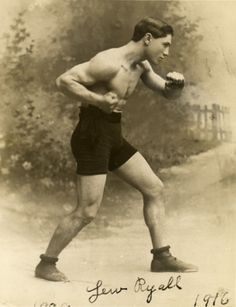

[![Contributors][contributors-shield]][contributors-url]
[![Forks][forks-shield]][forks-url]
[![Stargazers][stars-shield]][stars-url]
[![Issues][issues-shield]][issues-url]
[![LinkedIn][linkedin-shield]][linkedin-url]

<br />
<div align="center">
  <a href="https://github.com/dylanagyemang/Boxing-Website">
    
  </a>

  <h2 align="center">The Pugilist's Encyclopedia</h2>

  <p align="center">
    A full-stack educational boxing reference site built with Flask — covering punching technique, fighting styles, stances, movement, and a searchable database of 180+ world champion boxers scraped from Wikipedia.
    <br /><br />
    <a href="https://github.com/dylanagyemang/Boxing-Website/issues">Report Bug</a>
    ·
    <a href="https://github.com/dylanagyemang/Boxing-Website/issues">Request Feature</a>
  </p>
</div>

---

## Table of Contents

- [About](#about)
- [Pages](#pages)
- [Tech Stack](#tech-stack)
- [Project Structure](#project-structure)
- [Setup](#setup)
- [Utility Scripts](#utility-scripts)
- [Database](#database)
- [Contributing](#contributing)
- [Contact](#contact)

---

## About

The Pugilist's Encyclopedia is a Flask web application built as a personal project to learn full-stack Python web development. It has since grown into a detailed boxing reference covering:

- **Punch catalogues** — every major variant of the jab, straight/cross, hook, and uppercut with descriptions and notable practitioners
- **Fighting styles** — from pure boxer to brawler, swarmer to switch-hitter
- **Stances and guards** — Philly Shell, Peek-a-boo, High Guard, Low Guard, and more
- **Movement and angles** — footwork fundamentals, defensive and offensive movement, ring generalship
- **Boxer database** — 180+ world champions scraped from Wikipedia with records, weight classes, nicknames, and profile pages
- **Boxing IQ Quiz** — 30 questions drawn from all sections of the encyclopedia

---

## Pages

| Route | Page | Description |
|---|---|---|
| `/` | Home | Full-viewport hero + navigation card grid |
| `/styles` | Styles | 9 boxing styles from Boxer-Puncher to Switch-Hitter |
| `/stances` | Stances | 8 guards and stances with descriptions |
| `/jab` | The Jab | 15 jab variants |
| `/cross` | The Straight / Cross | 10 straight and cross variants |
| `/hook` | The Hook | 12 hook variants including Liver Blow and Shovel Hook |
| `/uppercut` | The Uppercut | 10 uppercut variants including the Bolo Punch |
| `/movement` | Movement and Angles | 14 footwork, defense, offense, angle, and ring generalship entries |
| `/quiz` | Boxing IQ | 30-question multiple-choice quiz with instant scoring |
| `/boxers` | Boxer Database | Paginated, filterable grid of 180+ boxers |
| `/boxers/<id>` | Boxer Profile | Individual profile with record, stats, titles, and Wikipedia link |
| `/login` | Login | User authentication |
| `/signup` | Sign Up | New user registration |

---

## Tech Stack

**Backend**
- [Flask](https://flask.palletsprojects.com/) — web framework
- [Flask-SQLAlchemy](https://flask-sqlalchemy.palletsprojects.com/) — ORM with SQLite
- [Flask-Login](https://flask-login.readthedocs.io/) — user session management
- [Flask-WTF](https://flask-wtf.readthedocs.io/) — CSRF protection
- [python-dotenv](https://github.com/theskumar/python-dotenv) — environment variable loading
- [requests](https://requests.readthedocs.io/) + [BeautifulSoup4](https://www.crummy.com/software/BeautifulSoup/) — Wikipedia scraper

**Frontend**
- [Bootstrap 4.4.1](https://getbootstrap.com/) — layout and components
- [Font Awesome 4.7.0](https://fontawesome.com/) — icons
- [Google Fonts](https://fonts.google.com/) — Oswald (headings) + Open Sans (body)
- Vanilla JS — search autocomplete, quiz logic, scroll-reveal animations

---

## Project Structure

```
boxingwebsite/
├── main.py                    # App entry point
├── scrape_boxers.py           # Wikipedia scraper — populates the boxer database
├── clean_boxer_names.py       # One-time script to repair dirty scraped names
├── requirements.txt
│
└── website/
    ├── __init__.py            # App factory (Flask, SQLAlchemy, LoginManager, CSRF)
    ├── models.py              # SQLAlchemy models: User, Note, Boxer
    ├── views.py               # Content page routes (/, /jab, /hook, /quiz, etc.)
    ├── auth.py                # Login, signup, logout routes
    │
    ├── boxers/
    │   ├── __init__.py        # boxers_bp Blueprint
    │   └── routes.py          # /boxers, /boxers/<id>, /boxers/search
    │
    ├── templates/
    │   ├── base.html          # Shared layout: navbar, auth bar, footer, JS imports
    │   ├── home.html          # Homepage hero + section card grid
    │   ├── styles.html        # Fighting styles page
    │   ├── stances.html       # Stances and guards page
    │   ├── jab.html           # Jab variants page
    │   ├── cross.html         # Straight/cross variants page
    │   ├── hook.html          # Hook variants page
    │   ├── uppercuts.html     # Uppercut variants page
    │   ├── movement.html      # Movement and angles page
    │   ├── quiz.html          # Boxing IQ quiz
    │   ├── login.html
    │   ├── signup.html
    │   └── boxers/
    │       ├── index.html     # Boxer listing with filters and pagination
    │       └── profile.html   # Individual boxer profile
    │
    └── static/
        ├── index.css          # All custom styles (~1400 lines)
        ├── scroll.js          # IntersectionObserver scroll-reveal + sidebar toggle
        └── [media files]      # GIFs, MP4s, SVGs, images
```

---

## Setup

**Requirements:** Python 3.10+

```bash
# 1. Clone the repo
git clone https://github.com/dylanagyemang/Boxing-Website.git
cd Boxing-Website

# 2. Create and activate a virtual environment
python -m venv venv
# Windows
venv\Scripts\activate
# macOS / Linux
source venv/bin/activate

# 3. Install dependencies
pip install -r requirements.txt

# 4. Create a .env file
echo SECRET_KEY=your-secret-key-here > .env

# 5. Run the app
python main.py
```

The app will be available at `http://127.0.0.1:5000`.

The SQLite database (`website/database.db`) is created automatically on first run.

**To populate the boxer database:**

```bash
python scrape_boxers.py
```

This scrapes ~235 Wikipedia pages (one per boxer, with a 1-second delay between requests) and inserts any new records. Already-present entries are skipped, so it is safe to re-run.

---

## Utility Scripts

### `scrape_boxers.py`

Scrapes boxer data from the Wikipedia API for every page listed in `BOXER_PAGES` and saves results to the database. Extracts: name, nickname, hometown, nationality, weight class, stance, years active, W-L-D record, KO count, titles, image URL, and Wikipedia URL.

```bash
python scrape_boxers.py
```

### `clean_boxer_names.py`

A one-time repair script for names that were scraped with noise — honorifics (MBE, OBE, Sir), non-Latin script annotations (Japanese, Thai, Cyrillic), quoted ring names, and accent variants. Uses regex cleaning, a manual overrides dictionary, and `difflib` fuzzy matching against the canonical `BOXER_PAGES` list to correct all dirty records.

```bash
python clean_boxer_names.py
```

---

## Database

The `Boxer` model stores:

| Field | Type | Notes |
|---|---|---|
| `name` | String | Canonical display name |
| `nickname` | String | Ring nickname |
| `hometown` | String | City / country of birth |
| `nationality` | String | |
| `weight_class` | String | From Wikipedia infobox |
| `stance` | String | Orthodox, Southpaw, Switch |
| `years_active` | String | Career span |
| `record_wins` | Integer | |
| `record_losses` | Integer | |
| `record_draws` | Integer | |
| `wins_by_ko` | Integer | |
| `no_contests` | Integer | |
| `titles` | Text | Pipe-separated list of title reigns |
| `image_url` | String | Wikipedia thumbnail URL |
| `wikipedia_url` | String | Full Wikipedia article URL |

The `/boxers` page supports filtering by weight class and nationality, full-text search by name or nickname (via `/boxers/search` JSON endpoint), and pagination at 12 boxers per page.

---

## Contributing

If you have a suggestion, please fork the repo and open a pull request, or open an issue with the tag "enhancement".

1. Fork the project
2. Create your feature branch (`git checkout -b feature/AmazingFeature`)
3. Commit your changes (`git commit -m 'Add some AmazingFeature'`)
4. Push to the branch (`git push origin feature/AmazingFeature`)
5. Open a Pull Request

---

## Contact

**Dylan Agyemang** — [dagyeman12@gmail.com](mailto:dagyeman12@gmail.com)

Project: [https://github.com/dylanagyemang/Boxing-Website](https://github.com/dylanagyemang/Boxing-Website)

[![LinkedIn][linkedin-shield]][linkedin-url]

---

<!-- MARKDOWN LINKS -->
[contributors-shield]: https://img.shields.io/github/contributors/dylanagyemang/Boxing-Website.svg?style=for-the-badge
[contributors-url]: https://github.com/dylanagyemang/Boxing-Website/graphs/contributors
[forks-shield]: https://img.shields.io/github/forks/dylanagyemang/Boxing-Website.svg?style=for-the-badge
[forks-url]: https://github.com/dylanagyemang/Boxing-Website/network/members
[stars-shield]: https://img.shields.io/github/stars/dylanagyemang/Boxing-Website.svg?style=for-the-badge
[stars-url]: https://github.com/dylanagyemang/Boxing-Website/stargazers
[issues-shield]: https://img.shields.io/github/issues/dylanagyemang/Boxing-Website.svg?style=for-the-badge
[issues-url]: https://github.com/dylanagyemang/Boxing-Website/issues
[linkedin-shield]: https://img.shields.io/badge/-LinkedIn-black.svg?style=for-the-badge&logo=linkedin&colorB=555
[linkedin-url]: https://www.linkedin.com/in/dylan-agyemang-8a33b942/
